# Data Visualization with Pokemon Go

## SMU Data Science Bootcamp 2021
### Team Members: 
* Bao Pham
* JR Chester
* Tom Munson
* Tiffany Harris

#### Introduction
Pokemon (also known as Pocket Monsters in Japan) is a children’s video game based in a fictional world where humans coexist alongside supernatural animals called “Pokemon”. Since the company’s inception in 1995, there have been nearly 900 Pokemon created, all with varying levels of rarity and battle ability. Our goal is to gather and organize a cohesive database of Pokemon statistics, encapsulating all 898 Pokemon.  

The world of Pokémon is complex and has inspired millions of people to “go and catch ‘em all” across multiple games and platforms for over two decades. It is a colorful and rich dataset, full of history and nostalgia for many across the world.  

#### Sneak Peak of the End Result
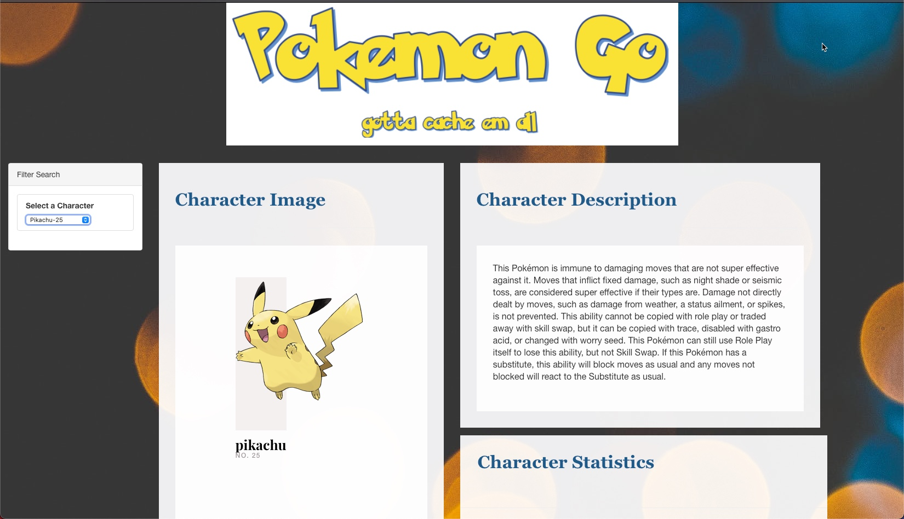 
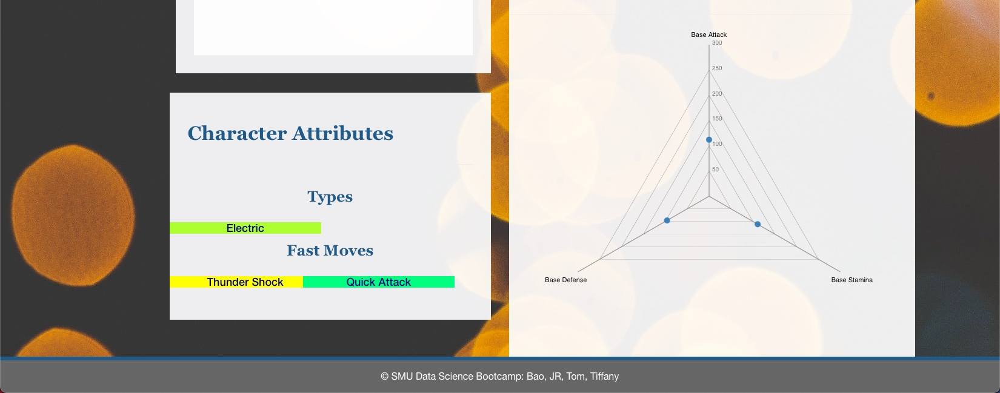 

#### Data Sources & ETL Process
Pokemon Go character data was collected from an API using Python. The ETL process was performed in Python using a Jupyter Notebook server. API documentation can be found at [Pogo API] (https://pogoapi.net/documentation/).   
  

 Using the Python requests library, the API data was extracted and transformed from json data into dataframes using the Python pandas library.  
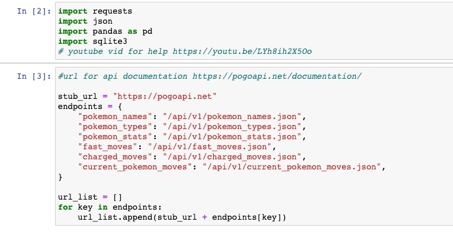 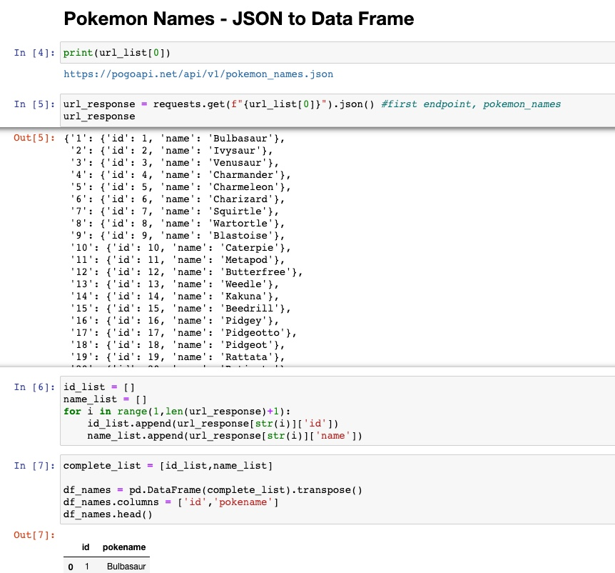 

 Because of nested dictionaries and lists, a custom function was used to parse portions of the API json data. We used regular expressions to find and replace special characters to clean the data after parsing.  
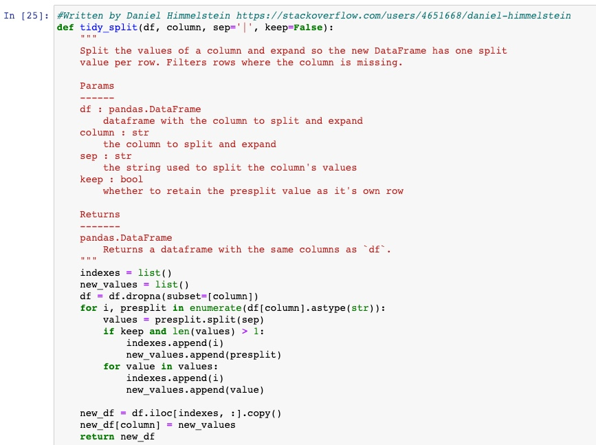 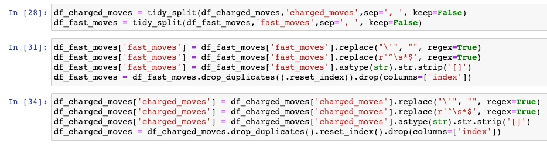 

 Once the data frames were properly constructed and the data was cleaned, the Python sqlite library was employed to insert the dataframes into SQL database tables. To effectively executive the entire Python file multiple times (for debugging) without error, try/except statements were incorporated as well as DROPTABLE prior to CREATE TABLE statements.  
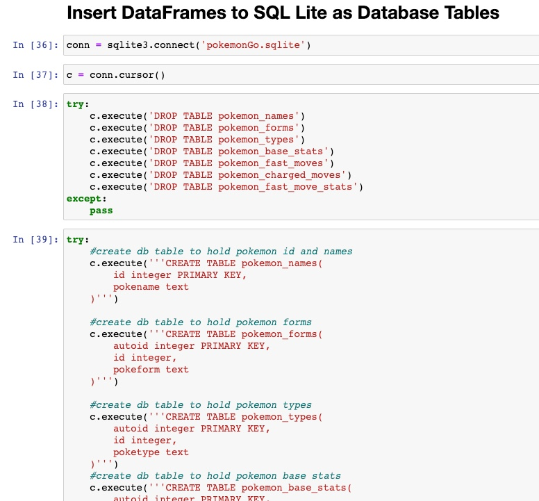  

#### Scripts, Functions and Behind the Scenes
 All Pokemon characters are assigned universal Pokemon character ID numbers. This made joining the data sources much easier than trying to identify and match on each character's name. Character images were retrieved using a static url with the Pokemon ID concatenated at the end of the url.  
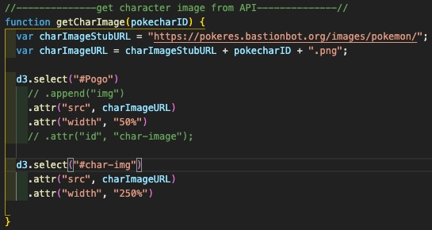 

 Character descriptions were pulled from the PokeAPI website. By concatenating the Pokemon ID to the end of the URL, we were able to write a Javascript function using the D3 library to incorporate the character description. 
  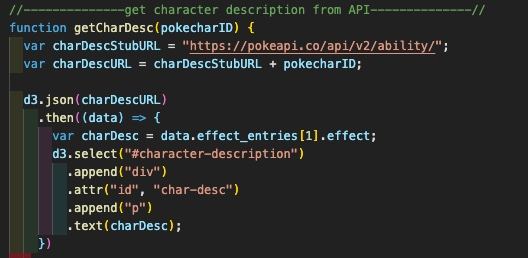 

 The data from the SQL Lite database was incorporated into the website using the Python flask library coupled with SQL Alchemy. Because we were using Bootstrap components in our web application, an additional Python library flask_bootstrap was also incorporated. 
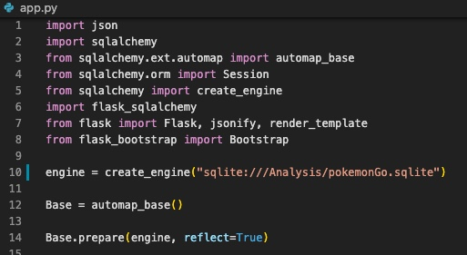 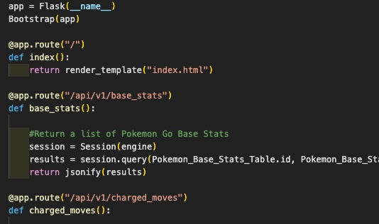

 Because of the various Pokemon types, differentiating colors were used to have each type stand out to the user on the webpage. A switch statement was incorporated to change the background color and text color depending on the Pokemon type.  
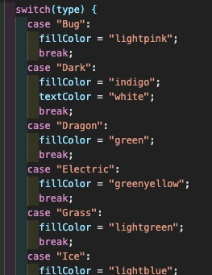 

 To show versatility in our code, an additional switch statement was used for the colors of the Pokemon moves, except this time the colors change for every other element. The modulus operator was used here. 
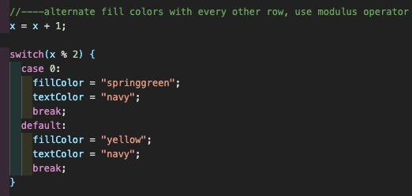 

 The radar graph was chosen as the visual representation of the Pokemon character's base statistics. This is typically the chart of choice in the Pokemon gaming world. The graph was built using the Javascript D3 library and svg vectors. 
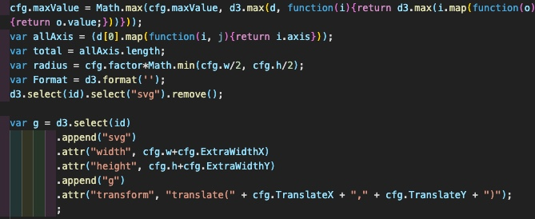 

 When the user hovers over each data point on the radar graph, the base statistic appears in using a tooltip with a mouseover event listener. 
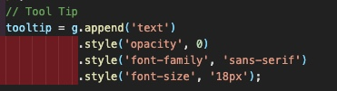
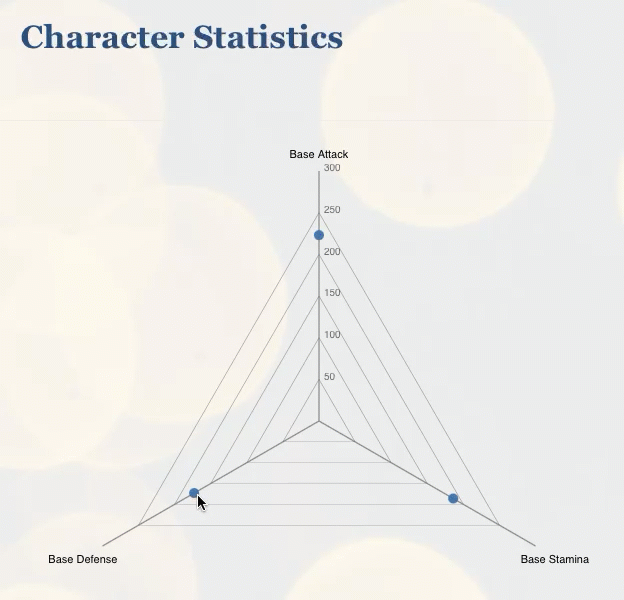 

 The entire webpage moves and transforms simultaneously as the user selects their Pokemon character from the drop down list. The Pokemon ID drives the data changes behind the scenes to update each visual. 
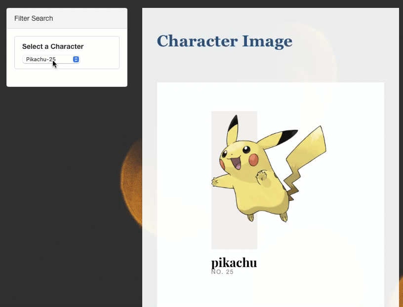 

#### Javascript Anime Library
 By far the most complex and challenging element of this entire project was incorporating the [Javascript Anime library](https://animejs.com). Anime is a powerful and advanced Javascript library that uses CSS, SVG and DOM to translate Javascript objects on html pages. 
 What started out as an intriguing idea, quickly consumed many hours of debugging and troubleshooting. Our teammate, Bao Pham, spent many hours decoding line by line to change the Anime library to incoporate the animation. 
 When the user clicks on the character image, a new window expands to show a larger image as well as the character types. Clicking on the magnify glass zooms into the character and spins it. All of this is done without redirecting the user to a new page. 
 

#### Data Limitations
 There are 890 Pokemon Go characters. The URL that was used to pull in the character descriptions stopped at Pokemon character 191. Originally, a catch statement was written into the Javascript function to account for characters that did not have a description. To enhance the user experience, these characters without descriptions were removed from the character dropdown list. An addition Python script was created to filter the dataset and only show the characters with descriptions available. 
 Github only allows 50MB of free file storage. The PowerPoint presentation for the class project incorporates animation, transition and many images. The file size of the presentation alone exceeded 73MB. Even after compressing the file, the entire repo still exceeded Github's 50MB maximum allowed size. The presentation was flattened to a PDF and compressed to reduce the file size. 
 

#### File Structure and Programming Languages
* Prework
    * Software platforms: Microsoft Word, Adobe Acrobat, Sketch
    * Proposal: [Project2Proposal.pdf](Prework/Project2Proposal.pdf)
    * Design Sketch: [designSketchPokemonGo.png](Prework/DesignSketch/designSketchPokemonGo.png)
* ETL, API retrieval and Data Cleaning
    * Languages used: Python
    * Software platforms: Jupyter Notebook, DB Browser for SQLite
    * Files: [Analysis.ipynb](Analysis/Analysis.ipynb), [CharacterDescriptions.ipynb](Analysis/CharacterDescriptions.ipynb), [pokemonGo.sqlite](Analysis/pokemonGo.sqlite)
* Flask App
    * Languages used: Python
    * Software platforms: Visual Studio Code
    * Files: [app.py](app.py)
* Webpages
    * Languages used: HTML, CSS
    * Software platforms: Visual Studio Code
    * Files: [index.html](templates/index.html), [base.html](templates/base.html), [bootstrap.min.css](static/bootstrap.min.css), [styles.css](static/styles.css)
* Scripts (excluding Anime.js library)
    * Languages used: Javascript
    * Software platforms: Visual Studio Code
    * Files: [logic.js](static/logic.js), [radar_chart.js](static/radar_chart.js)
* Anime Scripts
    * Languages used: Javascript, CSS
    * Software platforms: Visual Studio Code
    * Files: [anime.min.js](static/anime.min.js), [main.js](static/main.js), [Pokeball.webp](static/Pokeball.webp), [base.css](static/base.css), [imagesloaded.pkgd.min.js](static/imagesloaded.pkgd.min.js), [pater.css](static/pater.css)
